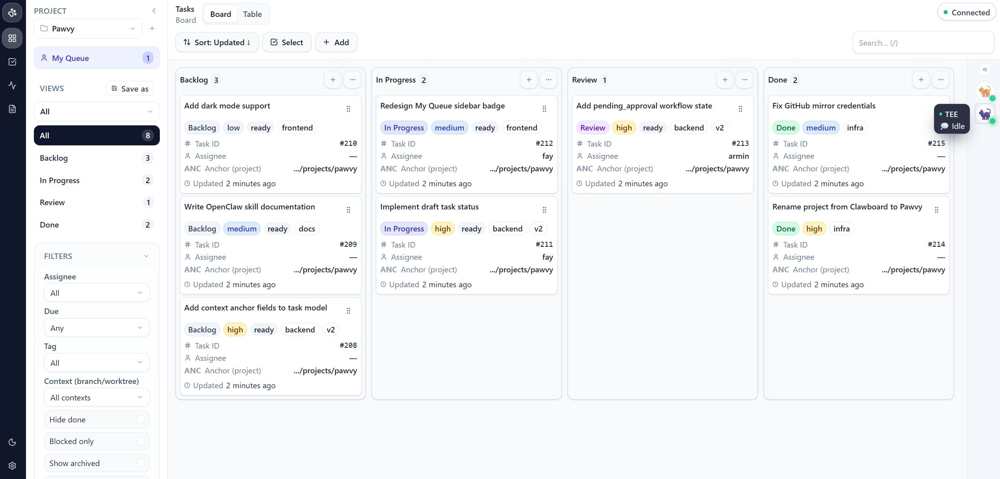
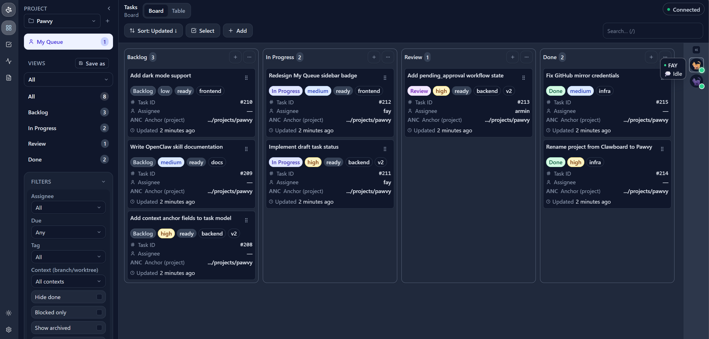
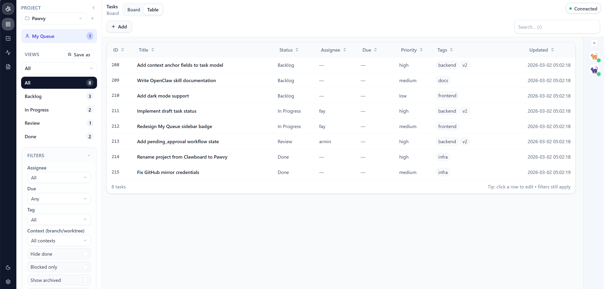

# Pawvy

**The task layer for human-agent teams.**

Pawvy is an open-source task and project management tool built for developers who work alongside AI agents. Instead of checking in on your agents constantly, Pawvy gives them the context to start—and brings their work back to you at exactly the right moment.

> Give your agents context. Close the loop together.



## Why Pawvy

Most task tools were built for humans managing humans. Pawvy is built for a different reality: one human, one or more AI agents, and work that flows between them.

Agents don't just execute tasks—they need to know *why* a task exists, *what done looks like*, and *when to surface work for your review*. Pawvy makes that handoff explicit, so nothing gets lost between your intent and the agent's execution.

## ✨What You Can Do

### See Everything at a Glance

A kanban board and table view give you a live picture of what's in progress, what's waiting for review, and what's done. Switch views without losing your filters.



### Know what Needs Your Attention

**My Queue** surfaces tasks that need a human decision right now—work your agents have completed and surfaced for review, plus anything explicitly assigned to you. One click, no hunting.



### Give Agents Real Context

Attach reference docs, acceptance criteria, and scope notes directly to tasks. Your agents read the task and start—no lengthy prompts, no repeated explanations.

Every agent task resolves to a [context anchor](docs/context-anchors.md) — a filesystem path that grounds the agent's work. Pawvy figures out the right directory automatically, or you can set one explicitly.

### Keep Personal Tasks Separate

The [Inbox](docs/inbox.md) is for reminders and to-dos that don't need an agent — shopping lists, quick notes, anything human-only. They live separately from the Kanban board and never get picked up by agents.

## 🛠 Tech Stack

- **Backend:** Node.js + Express + SQLite + WebSocket
- **Frontend:** React + TypeScript + Tailwind CSS + @dnd-kit

## 🚀 Quickstart

**Prerequisites:** Node.js 22+, pnpm

```bash
# Clone and install
git clone https://github.com/arminzou/pawvy.git
cd pawvy
pnpm install

# Start development server
pnpm dev
```

Open `http://localhost:5173`—backend runs on port 3001.

**With Docker:** see [docker-compose setup →](docs/docker.md)

**Mobile / LAN access:** if desktop works but mobile gets stuck reconnecting, point the frontend directly to your backend's LAN IP. In `frontend/.env.local`:

```bash
API_BASE=http://192.168.20.10:3001
WS_BASE=ws://192.168.20.10:3001/ws
PAWVY_API_KEY=your-api-key
```

Then restart the dev server.

## 🧩 OpenClaw Integration

Pawvy is built to work with [OpenClaw](https://github.com/openclaw/openclaw). Your agents can create tasks, update status, and surface work for review—all through the Pawvy API or the built-in OpenClaw skill.

```bash
# Install the Pawvy skill in your OpenClaw workspace
# Then agents can: create tasks, update status, list their queue
```

See [OpenClaw integration guide →](docs/openclaw-integration.md)

## Common Workflows

- **Agent creates a task** → populates context → surfaces for your review → you approve and close the loop
- **You create a task** → agent picks it up → does the work → moves to review → you approve
- **Check My Queue** → see everything needing your attention in one place → act or send back

[Full workflow guide →](docs/agent-design.md)

## Roadmap

**v0.1.0 (current)**—Kanban board, table view, projects, My Queue, agent API, OpenClaw integration, Inbox, context anchors

**v1.0.0 (in design)**—Draft states, `pending_approval` flow, review notes with versioning, actor-aware transition enforcement. Full agent-human approval loop.

See [ROADMAP.md](ROADMAP.md) for details.

## 📖 Documentation

- [Workflow guide →](docs/agent-design.md)
- [OpenClaw integration →](docs/openclaw-integration.md)
- [Inbox →](docs/inbox.md)
- [Context anchors →](docs/context-anchors.md)

## 🤝 Contributing

Contributions welcome. See [CONTRIBUTING.md](CONTRIBUTING.md) for the full guide.

```bash
git clone https://github.com/arminzou/pawvy.git
cd pawvy
pnpm install
pnpm dev
```

## 📜 License

MIT—see [LICENSE](LICENSE)
